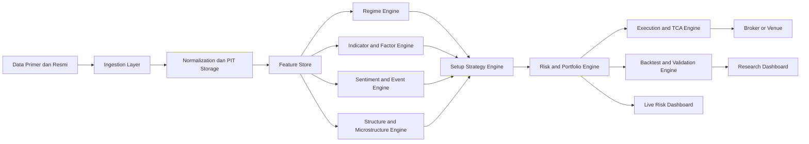
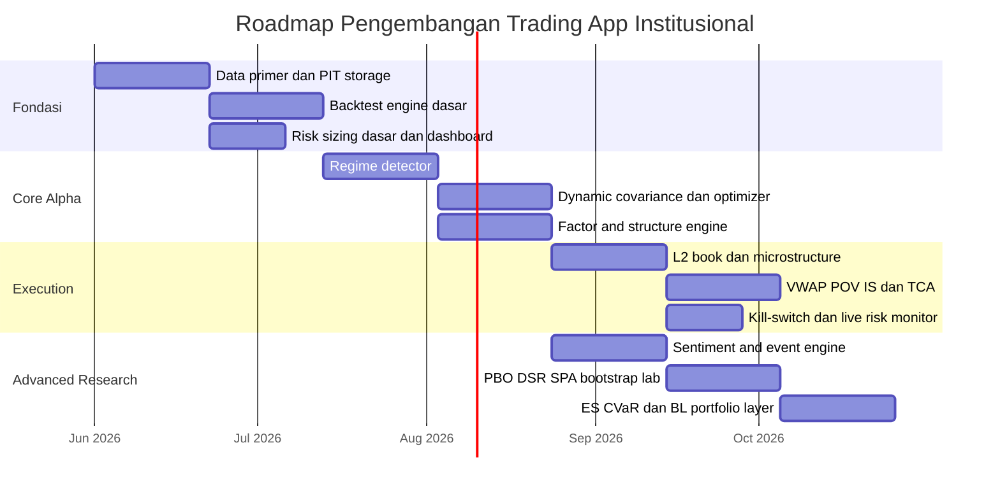

# Kerangka Teknis Lanjutan untuk Aplikasi Trading dan Sinyal Institusional

## Ringkasan eksekutif

Ya, sangat mungkin mematangkan aplikasi trading/signal Anda menjadi jauh lebih advance. Lonjakan kualitas terbesar **bukan** datang dari menambah indikator retail baru, tetapi dari menambahkan lapisan yang biasa dipakai manajer institusional: **deteksi rezim pasar**, **estimasi covariance dan risk yang dinamis**, **factor/style premia lintas aset**, **portfolio construction yang tahan estimation error**, **microstructure dan liquidity-aware execution**, serta **validasi statistik yang dirancang khusus untuk mencegah backtest overfitting**. Fondasi teoretisnya datang dari garis yang sangat jelas: Markowitz untuk mean-variance, Sharpe untuk CAPM, Kelly untuk growth-optimal sizing, Hamilton untuk regime shifts, Engle untuk volatility/correlation modeling, Black–Litterman untuk Bayesian portfolio construction, Rockafellar–Uryasev untuk CVaR, dan Almgren–Chriss untuk optimal execution. citeturn38search15turn38search16turn38search2turn31search7turn35search6turn4search3turn33search3turn7search0

Jika harus diurutkan, prioritas pengembangan yang paling “institutional-grade” adalah: **regime engine**, **dynamic risk/covariance engine**, **cross-asset factor and style engine**, **portfolio/risk optimizer**, **execution/liquidity engine**, lalu **sentiment/event engine**. Urutan itu penting karena praktik institusional yang matang cenderung lebih andal dalam **memodelkan risiko** dan **biaya implementasi** daripada sekadar mengejar sinyal return mentah; bahkan riset AQR dan Man Group menekankan bahwa kapasitas, transaksi, dan risk forecasting menentukan apakah alpha benar-benar bisa dipanen setelah biaya. citeturn39search8turn39search3turn5search6turn5search12

Secara implementasi, aplikasi Anda sebaiknya bergeser dari arsitektur “indikator berdiri sendiri” menjadi **mixture-of-engines**: setiap engine menghasilkan sinyal terstandarisasi, lalu mesin setup dan risk melakukan *gating* berdasarkan rezim, likuiditas, crowding, dan cost. Dengan kata lain, RSI/MACD boleh tetap ada, tetapi posisinya turun menjadi fitur turunan kecil, bukan pusat keputusan. Bukti yang lebih kuat di literatur justru ada pada time-series momentum, style premia, dynamic covariance, order-flow imbalance, liquidity metrics, dan robust portfolio construction. citeturn32search13turn32search1turn39search2turn35search6turn34search4turn6search0turn6search1

Dari sisi data, prioritas tertinggi adalah **sumber primer atau resmi**: SEC EDGAR untuk filings dan XBRL, FRED/ALFRED untuk data dan vintages makro, CFTC COT untuk positioning, situs dan kalender bank sentral untuk rilis kebijakan, lalu feed resmi exchange untuk market data, funding, open interest, dan order book. SEC menyatakan API EDGAR publik menyediakan JSON untuk submissions dan XBRL dan diperbarui intraday secara real time; FRED menyediakan API REST untuk series dan observations; CFTC menyediakan COT lengkap dengan jadwal rilis; Binance dan Coinbase menyediakan WebSocket publik untuk orders/trades serta endpoint funding/open interest. citeturn0search0turn0search4turn1search0turn1search5turn40search0turn40search1turn8search1turn8search2turn8search0turn8search18

Rekomendasi akhir laporan ini sederhana: bangun dulu **mesin risk dan validasi** yang keras kepala terhadap overfitting, baru setelah itu agresif menambah alpha. Kalau risk dan research layer lemah, sinyal secanggih apa pun cuma jadi *backtest cosplay*. citeturn3search0turn3search1turn2search4turn2search21

## Arsitektur model yang paling layak ditambahkan

Model-model di bawah ini adalah daftar prioritas yang paling masuk akal jika target Anda adalah aplikasi sinyal yang lebih dekat ke standar desk kuantitatif, CTA, macro fund, atau allocator institusional. Daftar ini sengaja menekankan metode yang punya akar kuat di akademik dan sudah lama dipakai di asset management besar. citeturn38search15turn4search3turn5search1turn32search1turn39search2turn7search0

### Daftar prioritas model dan algoritma

| Prioritas | Model / algoritma | Formulasi inti | Kenapa layak ditambah | Input utama | KPI yang wajib dilacak | Failure mode utama | Kompleksitas | Dasar sumber |
|---|---|---|---|---|---|---|---|---|
| Sangat tinggi | **Markov-switching / HMM regime engine** | \(r_t=\mu_{s_t}+\sum_{i=1}^p\phi_{i,s_t}r_{t-i}+\varepsilon_t,\;P(s_t=j\mid s_{t-1}=i)=p_{ij}\) | Menangkap *state dependence* pasar: trend, range, stress, crash. Ini jauh lebih berguna daripada satu threshold volatilitas statis. | Return multi-horizon, realized vol, cross-asset correlation, liquidity stress, term structure | Regime hit rate, Brier score, regime persistence, PnL by regime | Turn point terlambat, state terlalu banyak, rezim palsu saat shock singkat | Sedang | citeturn31search7turn31search12turn5search5 |
| Sangat tinggi | **DCC-GARCH + shrinkage covariance** | \(H_t=D_tR_tD_t\), \(Q_t=(1-a-b)\bar Q+a z_{t-1}z'_{t-1}+bQ_{t-1}\), lalu \(\hat\Sigma=\delta F+(1-\delta)S\) | Ini pondasi untuk position sizing, vol targeting, risk parity, dan portfolio optimization yang tidak rapuh pada estimation error. | Return historis, OHLC, intraday realized vol | Forecast error volatilitas, tracking error ex-ante vs ex-post, turnover risk, stability of \(\Sigma_t\) | Overreaction saat vol spike, curse of dimensionality bila universe terlalu besar | Sedang–tinggi | citeturn35search6turn35search18turn35search16turn34search4 |
| Sangat tinggi | **Time-series momentum yang di-vol-target** | \(s_{i,t}=\sum_h \alpha_h \frac{r_{i,t-h:t-1}}{\hat\sigma_{i,t}}\), lalu \(w_{i,t}\propto \text{sign}(s_{i,t})\) dan \(w_t^{scaled}=w_t\cdot \sigma^*/\hat\sigma_t\) | Salah satu gaya paling robust lintas aset; bukti kuat pada futures, FX, bonds, commodities, equities. | Harga, return multi-horizon, volatilitas | Sharpe net-of-cost, convexity in stress, crisis alpha, turnover | Whipsaw di pasar range/chop | Rendah–sedang | citeturn32search13turn32search1turn32search3turn5search0 |
| Tinggi | **Style premia / multi-factor scoring** | \(Score_{i,t}=\sum_f w_f z_{i,f,t}\) untuk value, momentum, carry, quality, low-risk | Ini lebih institusional daripada indikator tunggal; AQR menunjukkan style dapat dipakai lintas pasar/kelas aset. | Faktor dasar per aset, fundamentals, carry/basis, volatility, trends | Information coefficient, factor hit rate, factor crowding, turnover, capacity | Crowding, factor crashes, data revisions | Sedang | citeturn39search2turn39search10turn5search5 |
| Tinggi | **Black–Litterman portfolio constructor** | \(\Pi=\lambda\Sigma w_{mkt}\), \(\mu_{BL}=[(\tau\Sigma)^{-1}+P'\Omega^{-1}P]^{-1}[(\tau\Sigma)^{-1}\Pi+P'\Omega^{-1}Q]\) | Solusi praktis untuk problem Markowitz yang sensitif, konsentratif, dan mudah “ngaco” saat input sedikit berubah. | Covariance matrix, market-cap weights, views \(Q\), confidence \(\Omega\) | Weight stability, realized TE, posterior-view accuracy | Salah set confidence, views bias, posterior terlalu dominan | Sedang | citeturn4search3turn38search15 |
| Tinggi | **Risk parity / equal risk contribution** | \(RC_i=\frac{w_i(\Sigma w)_i}{\sqrt{w'\Sigma w}}\), target \(RC_i=b_i\sigma_p\) | Cocok untuk portfolio lintas aset dan untuk menghindari dominasi satu bucket risiko. | Covariance matrix, vol target, risk budgets | Risk contribution drift, diversification ratio, ES, drawdown | Leverage creep, correlation breaks saat stress | Sedang | citeturn5search1turn5search20turn5search14 |
| Tinggi | **Microstructure signals: OFI, impact, liquidity** | \(\Delta p_t=\beta_t \cdot OFI_t+\eta_t\), \(\beta_t\propto 1/Depth_t\); Amihud \(ILLIQ=\frac1D\sum |r_t|/\$V_t\) | Ini wilayah yang hampir selalu kosong di app retail, padahal sangat penting untuk entry, exit, slippage, dan adverse selection. | L2/L3 order book, trades, depth, volume, spreads | Slippage, fill-quality, queue loss, implementation shortfall, adverse selection | Feed drop, venue fragmentation, spoofing noise | Tinggi | citeturn6search0turn6search3turn6search10turn6search1turn6search12 |
| Menengah–tinggi | **Sentiment + event surprise engine** | \(sent_{i,t}=\frac{\sum_d e^{-\lambda\Delta t_d}q_d rel_{id}(p_{pos,d}-p_{neg,d})}{\sum_d e^{-\lambda\Delta t_d}q_d rel_{id}}\) | Nilai tambah terbesar datang ketika sentiment dikaitkan ke entitas, waktu rilis, dan surprise data resmi; bukan sekadar scraping headline acak. | Filings, statement bank sentral, press release, news, social, entity map | Precision/recall, directional hit rate after events, decay half-life | Sarcasm/noise, multilingual drift, entity mismatch | Sedang–tinggi | citeturn37search1turn37search12turn37search15turn28search16turn28search17turn28search22 |
| Tinggi | **ES/CVaR risk engine + stress testing** | \(ES_\alpha(L)=E[L\mid L\ge VaR_\alpha]\), atau \(\min_{\zeta,w} \zeta+\frac1{(1-\alpha)N}\sum(\ell(w,x_n)-\zeta)^+\) | Basel sendiri bergeser dari VaR ke Expected Shortfall untuk menangkap tail risk dengan lebih baik. | Scenario returns, covariance, liquidity horizons, stress shocks | ES, tail contribution, stress PnL, breach count | Tail under-sampling, regime break, underestimated liquidity | Sedang | citeturn33search3turn33search5turn33search8 |
| Sangat tinggi | **Execution algos: Almgren–Chriss, VWAP, POV, IS** | \(E[C]=\frac12\gamma X^2+\epsilon\sum|n_k|+\eta\sum \frac{n_k^2}{\tau_k}\), \(Var[C]=\sigma^2\sum\tau_k x_k^2\) | Tanpa execution engine, alpha bagus sering mati di slippage. POV/VWAP/IS memberi kontrol pace dan market impact. | Order book, volume curve, urgency, venue rules, fees | Arrival slippage, VWAP slippage, fill ratio, market impact, opportunity cost | Wrong urgency, bad volume forecast, leakage | Tinggi | citeturn7search0turn7search2turn7search16turn7search17 |

### Implikasi desain yang paling penting

Secara institusional, kombinasi yang paling kuat untuk **single-name / single-market signal app** adalah: **regime detector + trend/factor scoring + structure detection + microstructure filter + risk-aware sizing**. Untuk **multi-asset / portfolio app**, kombinasinya menjadi: **dynamic covariance + risk parity/vol targeting + Black–Litterman + execution/TCA**. Urutannya bukan kosmetik; Man Group menekankan bahwa risk forecasting dan volatility drag sangat menentukan hasil compounding, sedangkan AQR menunjukkan bahwa banyak anomaly tetap hidup setelah biaya **kalau** implementasinya disiplin dan cost-aware. citeturn5search0turn5search6turn39search8turn39search3

## Spesifikasi engine dan skema skor

Bagian ini mengubah model-model di atas menjadi spesifikasi aplikasi yang implementable. Rekomendasi utamanya adalah memakai **arsitektur sinyal berlapis**: *data → features → engine-level score → setup score → risk-adjusted position → execution*. Ini jauh lebih tahan banting daripada satu “super indikator”. citeturn35search6turn32search13turn7search0

### Engine rezim pasar

Engine ini sebaiknya mengeluarkan **probabilitas rezim**, bukan label keras. Format output minimal adalah empat state: **trend**, **range/mean-revert**, **high-vol / unstable**, dan **crash / liquidity stress**. Secara matematis, pakai Markov-switching/HMM untuk state, lalu kombinasikan dengan fitur realized volatility, rolling correlation, depth/spread, term-structure, dan positioning. Kalman filter layak dipakai sebagai *state smoother* untuk latent trend dan noise reduction. citeturn31search7turn31search1turn35search6

Formulasi inti yang saya rekomendasikan:

\[
\pi_t = P(s_t \mid x_{1:t})
\]

\[
r_t=\mu_{s_t}+\sum_{i=1}^{p}\phi_{i,s_t}r_{t-i}+\varepsilon_t,\quad \varepsilon_t\sim N(0,\sigma_{s_t}^2)
\]

Output yang harus ditampilkan ke UI bukan cuma state sekarang, tetapi juga **posterior probabilities**, **transition matrix**, **state duration**, dan **PnL contribution by regime**. Itu yang membedakan modul serius dari modul “lampu hijau-merah” doang. citeturn31search12turn5search5

### Engine indikator dan scoring lintas horizon

Engine scoring jangan memakai indikator mentah, tetapi **robust standardized features**. Saya sarankan seluruh fitur diubah lebih dulu menjadi robust z-score:

\[
z_{k,t} = \text{clip}\left(\frac{x_{k,t}-\text{median}_{252}(x_k)}{\text{MAD}_{252}(x_k)}, -3, 3\right)
\]

Lalu bentuk skor dasar per keluarga sinyal:

\[
S^{trend}_t = 0.45\,z_{TSMOM}+0.20\,z_{breakout}+0.20\,z_{AVWAP}+0.15\,z_{trend\_quality}
\]

\[
S^{factor}_t = \sum_f w_f z_{f,t}
\]

\[
S^{micro}_t = 0.40\,z_{OFI}+0.30\,z_{depth}+0.20\,z_{spread\_inv}+0.10\,z_{impact\_inv}
\]

Untuk **equities**, keluarga faktor yang paling layak adalah momentum, value, quality, low-risk, filing sentiment, dan liquidity. Untuk **FX**, carry, momentum, macro surprise, COT positioning, dan volatility-adjusted trend. Untuk **futures**, time-series momentum, roll yield/carry, COT, dan term-structure shape. Untuk **crypto**, trend, funding, basis, open interest, dan multi-venue microstructure. Lintas aset seperti ini lebih dekat ke praktik style premia daripada indikator retail tradisional. citeturn39search2turn39search10turn32search13turn40search0turn8search0turn8search18

### Engine sentimen dan event

Untuk sentiment, urutannya harus **sumber resmi dulu, news kedua, social terakhir**. SEC EDGAR, FOMC, ECB, BOE, BPS, dan notice exchange memberi sinyal yang lebih bersih daripada headline acak karena timestamp dan otoritas sumber lebih jelas. FinBERT sangat layak untuk baseline, karena memang dibuat untuk domain finansial dan menunjukkan peningkatan metrik terhadap pendekatan general-purpose pada dataset sentiment finansial. citeturn0search0turn28search16turn28search17turn28search22turn28search19turn37search1turn37search12

Formulasi yang saya sarankan adalah skor sentiment bertimbang kualitas-sumber dan peluruhan waktu:

\[
sent_{i,t}=\frac{\sum_d e^{-\lambda \Delta t_d}\,q_d\,rel_{id}\,(p_{pos,d}-p_{neg,d})}{\sum_d e^{-\lambda \Delta t_d}q_d}
\]

Untuk event, tambahkan **surprise score**:

\[
surprise_{j,t} = \frac{actual_{j,t} - forecast_{j,t}}{\sigma_j}
\]

\[
eventImpact_{i,t} = \sum_j \beta_{ij}\,surprise_{j,t}
\]

Kalau konsensus resmi/vendor belum ada, fallback yang masih layak adalah surprise relatif terhadap *nowcast* atau ekspektasi model internal. Jangan pakai kalender “copy-paste” yang timestamp-nya tidak point-in-time; itu undangan terbuka buat leakage. citeturn28search16turn28search21turn28search22turn1search0

### Engine struktur pasar dan deteksi setup

Untuk *structure detection*, saya sarankan menjauh dari konsep yang terlalu “retail chart-pattern only” dan mendekat ke alat yang memang dipakai desk dan execution practitioner: **anchored VWAP**, **swing highs/lows berbasis n-bar**, **volume profile nodes**, **opening range**, dan konfirmasi dari OFI/depth. VWAP juga punya dasar kuat di literatur execution. citeturn7search17turn6search0

Definisi dasar yang implementable:

\[
AVWAP_{t_0,t} = \frac{\sum_{u=t_0}^{t} P_u V_u}{\sum_{u=t_0}^{t} V_u}
\]

Break of structure long:

\[
BOS^{long}_t = \mathbf{1}\left(Close_t > SwingHigh_{last} + c\cdot ATR_t\right)\cdot \mathbf{1}(OFI_t>0)
\]

Setup score akhir sebaiknya *regime-gated*:

\[
\alpha_t = \sum_r \pi_{r,t}\,(W_r'z_t)
\]

\[
Score_t = 100\cdot \tanh(\alpha_t)\cdot LiquidityGate_t\cdot RiskGate_t
\]

Skema default yang praktis:

| Setup | Kondisi minimum | Stop | Exit dasar | Kapan dipakai |
|---|---|---|---|---|
| Trend continuation | \(\pi_{trend}>0.60\), \(S^{trend}>1.0\), harga di atas AVWAP, OFI positif | \(1.5\text{–}2.0\times ATR\) | trailing ATR / regime flip | Equities, futures, crypto |
| Pullback to trend | \(\pi_{trend}>0.60\), retrace ke AVWAP atau high-volume node, OFI pulih | \(1.2\text{–}1.8\times ATR\) | retest swing high/low | Semua aset likuid |
| Mean reversion to VWAP | \(\pi_{range}>0.60\), deviasi \(>1.5\sigma\), OFI reversal | \(1.0\text{–}1.5\times ATR\) | VWAP / mid-range | Equities index, FX, crypto |
| Event breakout | event surprise tinggi, spread/depth masih sehat, OFI searah | event-stop lebih lebar | time stop + impact fade rule | FX, index futures, rates, crypto |

Formulanya sendiri adalah desain rekomendasi, tetapi komponen-komponennya selaras dengan ATR/VWAP/OFI dan regime-based portfolio research. citeturn36search1turn7search17turn6search3turn31search7

### Engine risiko dan konstruksi posisi

Engine ini harus menjadi “boss terakhir”. Rekomendasi terbaik adalah **tiga lapis sizing**: ukuran awal dari conviction score, dikalibrasi dengan volatilitas/ATR, lalu dipotong dengan Kelly fraksional dan liquidity caps.

Untuk trade-level sizing:

\[
Units_{ATR} = \frac{Equity \times r_{trade}}{k \times ATR_t \times pointValue}
\]

Kelly biner:

\[
f^*=\frac{bp-q}{b}
\]

Aproksimasi kontinu yang sering dipakai untuk *edge per unit variance*:

\[
f^*\approx \frac{\mu}{\sigma^2}
\]

Untuk portfolio-level sizing:

\[
w_t^{vol} = w_t \cdot \frac{\sigma^*}{\hat\sigma_{p,t}}
\]

\[
RC_i=\frac{w_i(\Sigma w)_i}{\sqrt{w'\Sigma w}}
\]

Lalu gunakan **fractional Kelly** sebagai guardrail implementasi, bukan full Kelly. Secara praktis saya sarankan \(f=0.25f^*\) sampai \(0.50f^*\), **hanya** bila edge telah lolos validasi statistik dan net-of-cost tetap sehat. Kelly memberi log-growth optimum pada asumsi yang kuat, tetapi aplikasi trading nyata selalu menghadapi estimation error dan regime breaks. citeturn38search2turn36search1turn5search1turn5search12

### Engine backtest dan learning

Backtest yang layak deploy tidak cukup dengan satu equity curve “cakep”. Minimum yang seharusnya ada adalah **point-in-time replay**, **walk-forward**, **CSCV/PBO**, **Deflated Sharpe Ratio**, **White Reality Check**, **Hansen SPA**, dan **stationary bootstrap Monte Carlo**. White menulis masalah data snooping secara eksplisit; Hansen merancang SPA yang lebih kuat terhadap alternatif buruk/irrelevan; Bailey dan López de Prado memperkenalkan PBO/CSCV dan DSR untuk mengoreksi selection bias serta non-normality; Politis–Romano memberi stationary bootstrap yang cocok untuk dependence pada time series. citeturn3search0turn3search1turn2search4turn2search21turn3search2

Desain uji yang saya rekomendasikan:

- **Walk-forward anchored**: train 5 tahun, validate 1 tahun, test 6 bulan, rolling terus.
- **CSCV/PBO**: wajib untuk model dengan banyak hyperparameter atau library setup besar.
- **DSR/PSR**: laporkan bersama Sharpe biasa.
- **Stationary bootstrap Monte Carlo**: simulasi ulang trade sequence dan return blocks.
- **White RC / Hansen SPA**: uji apakah model terbaik benar-benar unggul setelah koreksi data snooping.

Kalau app Anda ingin punya “learning engine”, gunakan **recalibration schedule** yang disiplin, bukan auto-fit liar harian. Regime probabilities dan covariance boleh di-update sering; parameter model sinyal sebaiknya dikunci per research cycle. Kalau tidak, sistem akan belajar satu hal dengan cepat: cara membohongi Anda. citeturn35search6turn2search4turn3search0

## Data, preprocessing, frekuensi, dan infrastruktur

Secara kualitas hasil, data adalah *skill issue* paling brutal. Untuk naik kelas, prioritas harus jatuh pada sumber **primer/resmi**, lalu baru vendor komersial untuk menutup gap yang memang tidak tersedia resmi. SEC menyediakan data filings dan XBRL melalui `data.sec.gov`; FRED/ALFRED memberi akses API series dan vintages; CFTC memberi COT dan public reporting; bank sentral dan statistik nasional memberi kalender dan pernyataan kebijakan; Binance dan Coinbase menyediakan WebSocket publik untuk trade/order-level data serta endpoint derivatives seperti funding dan open interest. citeturn0search0turn0search5turn1search0turn1search3turn40search0turn40search5turn28search16turn28search17turn28search22turn8search2turn8search0turn8search18

### Sumber data dan API yang harus diprioritaskan

| Tier | Sumber resmi / primer | Cakupan utama | Kegunaan engine | Catatan implementasi |
|---|---|---|---|---|
| A | **SEC EDGAR / data.sec.gov** | Submissions, XBRL, filing history | Event, sentiment, fundamental, corporate actions proxy | JSON publik; SEC menyatakan data diperbarui intraday secara real time. citeturn0search0turn0search4 |
| A | **FRED / ALFRED API** | Series makro, release mapping, vintages | Regime, macro factor, event surprise, valuation | API REST, observations, versions/vintages; penting untuk menghindari revision leakage. citeturn1search0turn1search3turn1search5 |
| A | **CFTC COT / Public Reporting** | Positioning futures & options, open interest by category | Crowding, positioning, macro/futures signal | Posisi Selasa dirilis Jumat 3:30 p.m. ET; jangan salah alignment. citeturn40search1turn40search5turn40search8 |
| A | **Fed / ECB / BoE / BPS** | Kalender dan statement resmi | Event engine, macro sentiment | Gunakan timestamp resmi rilis dan press conference. citeturn28search16turn28search17turn28search21turn28search22turn28search19 |
| A | **Binance official market data** | Spot/futures trades, best bid/ask, funding, OI, mark price | Crypto microstructure, derivatives basis, execution | WebSocket real-time; aggregate trades 100ms; funding & OI endpoint resmi. citeturn8search1turn8search13turn8search19turn8search0turn8search18 |
| A | **Coinbase Exchange APIs** | Orders/trades, direct feed, REST/FIX/WebSocket | Crypto microstructure, execution, reconciliation | Ada public WebSocket, direct market data, REST, dan FIX endpoints. citeturn8search2turn8search14turn8search11 |
| A | **Feed venue-eksekusi primer** | Equity/futures trade, quote, depth | OFI, slippage, execution quality | Untuk microstructure engine, pakai feed venue primer atau direct exchange/SIP; agregator murah biasanya terlalu terlambat atau terlalu kotor. |
| B | **Vendor institusional berbayar** | Consensus estimates, clean corp actions, full newswire, reference master | Memperbaiki event surprise, revisions, corporate mapping | Dipakai hanya jika gap tidak tersedia dari sumber primer. |

### Dataset yang wajib ada dan preprocessing yang tidak boleh bolong

| Dataset | Minimum preprocessing | Leakage / bias yang harus dicegah |
|---|---|---|
| OHLCV / trades / quotes | dedup, bad-tick filter, clock normalization, partial day flags | look-ahead melalui bar aggregation yang salah |
| Order book L2/L3 | sequence gap detection, snapshot+replay, venue tagging, depth normalization | salah membangun book state dan phantom liquidity |
| Fundamentals / filings | point-in-time join, entity resolution, delisting handling | survivorship bias dan revised-data leakage |
| Futures | continuous-roll logic, back-adjust atau ratio-adjust, simpan carry/basis terpisah | carry hilang bila semua disatukan ke continuous price |
| Macro releases | actual timestamp, vintage storage, timezone normalization | memakai data revisi seolah-olah sudah diketahui sebelumnya |
| COT / positioning | align report date vs release date, category mapping | salah baca posisi Selasa sebagai data Jumat seketika |
| Sentiment text | de-dup, near-dup detection, entity linker, source ranking, language detection | headline duplikat menipu bobot sentiment |
| Crypto funding / OI | symbol normalization across venues, perp vs dated separation | mencampur instrumen berbeda menjadi satu seri palsu |

FRED/ALFRED, CFTC, dan SEC semuanya secara eksplisit mendukung konsumsi data terstruktur; keunggulannya baru terasa kalau layer preprocessing Anda benar-benar point-in-time. Kalau tidak, “model canggih” cuma berdiri di atas pasir. citeturn1search0turn1search3turn40search0turn0search0

### Pertimbangan frekuensi data dan latensi

Untuk **daily/4H**, engine yang paling efektif adalah regime, factor scoring, Black–Litterman, risk parity, dan event/macro. Untuk **5m–1h**, structure engine, trend pullback, dan intraday setup sudah masuk akal. Untuk **tick/L2/100ms**, barulah OFI, queue dynamics, slippage forecasting, serta execution algorithms benar-benar bernilai. Binance menyebut aggregate trade stream 100 ms dan best bid/ask real-time; Coinbase menyediakan WebSocket publik dan direct feed untuk market data real-time. citeturn8search19turn8search13turn8search2turn8search14

Implikasinya simpel: kalau Anda belum siap menyimpan dan merekonstruksi book/event stream dengan benar, **jangan** memaksa bikin engine microstructure penuh. Lebih baik mulai dari bar-based trend/factor/risk yang bersih, lalu naik level. Di FX spot khususnya, karena pasar global bersifat OTC dan tidak punya satu order book pusat, model order-flow harus disesuaikan ke venue atau broker data yang Anda pakai. BIS menegaskan skala dan sifat OTC pasar FX dalam survei triennialnya. citeturn9search3

### Rekomendasi stack komputasi

Untuk MVP yang serius tetapi belum HFT, kombinasi **Kafka atau NATS untuk streaming**, **TimescaleDB/Postgres untuk data operasional**, **ClickHouse untuk analytics/tick warehouse**, dan **DuckDB + Parquet untuk riset/backtest** adalah kombinasi yang sangat masuk akal. Kafka adalah distributed event streaming platform; NATS menekankan pub/sub ringan dan latency rendah; Redis Streams bagus untuk kebutuhan real-time yang lebih sederhana tetapi pub/sub biasa memiliki semantik at-most-once; TimescaleDB memperluas Postgres untuk real-time analytics time-series; ClickHouse memang cocok untuk financial tick/time-series analytics; DuckDB adalah database in-process yang enak dipakai untuk query Parquet dan eksperimen cepat. citeturn30search0turn30search12turn30search11turn30search1turn30search10turn29search9turn29search16turn29search20turn29search15turn29search27

Untuk kapasitas, panduan praktis saya seperti ini. **Bar-based system**: 8–16 vCPU, 64–128 GB RAM, NVMe, satu database analytics sudah cukup. **Multi-venue crypto/futures dengan L2**: 32–64 vCPU, 128–256 GB RAM, storage columnar terpisah, streaming bus nyata, dan observability penuh. **NLP sentiment**: CPU masih cukup untuk inference FinBERT batch kecil; GPU baru masuk akal kalau Anda fine-tune model sendiri atau melakukan document-level reranking dalam volume besar. Ini bagian yang lebih merupakan keputusan engineering daripada fakta akademik, jadi sesuaikan dengan universe dan horizon trading Anda.

Paragraf berikut menerjemahkan spesifikasi data dan compute di atas ke arsitektur sistem yang lebih konkret. Fondasi data primer/streaming dan store time-series berasal dari dokumentasi sumber resmi dan vendor open-source di atas. citeturn0search0turn1search0turn40search0turn8search2turn29search16turn30search0

## Sizing, guardrail, dan validasi statistik

### Skema pembobotan dan scoring yang konkret

Saya merekomendasikan **mixture-of-experts** yang digerakkan regime probabilities. Skor akhir jangan dijumlah mentah; dia harus dikalikan dengan filter likuiditas, biaya, dan keyakinan model. Template yang praktis:

\[
\alpha_t = \sum_r \pi_{r,t}(W_r' z_t)
\]

\[
CostPenalty_t = \exp(-\lambda_1 \widehat{slippage}_t - \lambda_2 \widehat{impact}_t)
\]

\[
FinalScore_t = 100 \cdot \tanh(\alpha_t)\cdot CostPenalty_t \cdot ConfidenceGate_t
\]

Default weight matrix yang saya sarankan untuk *single-asset alpha*:

| Rezim | Trend / momentum | Carry / value | Structure | Microstructure | Sentiment / event | Liquidity / crowding |
|---|---:|---:|---:|---:|---:|---:|
| Trend | 0.35 | 0.20 | 0.15 | 0.10 | 0.10 | 0.10 |
| Range | 0.10 | 0.15 | 0.30 | 0.20 | 0.10 | 0.15 |
| Stress | 0.20 | 0.10 | 0.10 | 0.20 | 0.10 | 0.30 |

Decision rule default:
- **Long** bila `FinalScore > +65`
- **Short** bila `FinalScore < -65`
- **Reduce / scale in** di `|Score| = 45–65`
- **Flat** bila `|Score| < 45`

Skema ini bukan hukum alam, tetapi sangat implementable dan konsisten dengan riset yang menunjukkan pentingnya rezim, biaya, dan likuiditas. citeturn31search7turn6search0turn39search8turn7search0

### Perbandingan metode position sizing

| Metode | Formula | Cocok untuk | Kelebihan | Kelemahan |
|---|---|---|---|---|
| Fixed fractional | \(Risk = E \times r\) | MVP, discretionary rule-engine | gampang, stabil | tak adaptif pada volatilitas |
| ATR-based sizing | \(Units=\frac{E\times r}{k\times ATR \times pointValue}\) | setup single-name / intraday / swing | adaptif pada range aktual | ATR bisa tertinggal saat shock | 
| Vol targeting | \(w=w_0 \cdot \sigma^*/\hat\sigma\) | portfolio multi-asset | stabilkan realized vol dan compounding | leverage naik di low-vol regime |
| Kelly penuh | \(f^*=(bp-q)/b\) atau \(\mu/\sigma^2\) | overlay teoritis saat edge tebal | growth-optimal secara teori | sangat sensitif ke estimation error |
| Fractional Kelly | \(f=c f^*\) | deployment nyata | lebih tahan noise | masih butuh estimasi edge yang valid |
| ERC / risk parity | target \(RC_i=b_i\sigma_p\) | portfolio cross-asset | diversifikasi risiko eksplisit | butuh covariance yang bagus |
| ES-budget sizing | solve min ES under return target | book dengan perhatian tail risk tinggi | lebih sadar tail risk | komputasi lebih berat |

Secara praktis, pilihan terbaik biasanya **bukan satu metode**. Untuk aplikasi Anda, saya akan menggabungkan: **ATR sizing untuk setup-level**, **target-vol untuk portfolio-level**, **fractional Kelly sebagai cap**, dan **ERC sebagai allocator lintas aset**. Kelly murni tidak boleh menjadi pusat sizing kecuali Anda sudah bisa membuktikan edge secara statistik setelah biaya. citeturn36search1turn38search2turn5search1turn33search3

### Risk limits dan guardrail yang saya rekomendasikan

Guardrail berikut adalah desain operasional yang saya nilai sehat untuk app yang ingin terasa profesional:

| Guardrail | Rekomendasi default |
|---|---|
| Risk per trade | 25–75 bps NAV untuk satu setup normal; 10–25 bps saat event high-uncertainty |
| Daily loss limit | 100–150 bps NAV, setelah itu hanya reduce/flatten |
| Weekly loss limit | 250–300 bps NAV |
| Max leverage gross | 1.5x untuk book discretionary-like; 2–4x hanya bila target-vol dan liquidity control kuat |
| Max participation | 5–10% ADV untuk equities normal; lebih rendah untuk small caps; venue cap ketat untuk crypto alt |
| Max book concentration | 10–15% NAV per nama; 20–25% per bucket tema/korlasi |
| Correlation cap | jika cluster correlation naik ekstrem, wajib de-gross |
| Event blackout | stop entry X menit sebelum rilis risiko tinggi, kecuali setup memang event-driven |
| Stale-data kill switch | stop trading bila feed sequence gap, clock drift, atau delayed venue status |
| Model-confidence gate | position scale turun otomatis bila DSR/SPA/PBO monitoring memburuk |

Karena microstructure dan transaction cost penting, saya juga menyarankan **liquidity-adjusted notional cap**:

\[
Notional_i \le \min\left(c_{ADV}\cdot ADV_i,\; c_{OI}\cdot OI_i,\; c_{margin}\cdot AvailableMargin\right)
\]

Dan objective portfolio yang lebih institusional:

\[
\max_w \; \alpha_t'w - \lambda_{risk} w'\Sigma_t w - \lambda_{tc} TC(w,w_{t-1})
\]

subject to:

\[
ES_{97.5\%}(w)\le E_{max},\quad \sum |w_i|\le G_{max},\quad |w_i|\le c_i
\]

Objective seperti ini menyatukan ide Markowitz/Black–Litterman, cost-aware execution, dan tail-risk control dalam satu rule yang bisa dioperasionalkan. citeturn38search15turn4search3turn7search0turn33search5

### Validasi statistik yang wajib dipasang sebelum live

Sebuah strategi layak masuk live bila lolos **serangkaian** uji, bukan satu angka Sharpe. Kerangka validasi yang saya sarankan:

| Lapisan uji | Target minimum yang layak deploy |
|---|---|
| Walk-forward OOS | OOS Sharpe net-of-cost positif dan stabil lintas jendela |
| Stability | parameter dan feature importance tidak liar antar-jendela |
| DSR | probabilistic confidence tinggi; penalize multiple trials |
| PBO / CSCV | peluang overfit serendah mungkin; idealnya < 10% |
| White RC / Hansen SPA | p-value lolos melawan data snooping |
| Bootstrap Monte Carlo | drawdown dan ES tetap masuk akal di resample dependent data |
| TCA | alpha pre-trade masih survive post-slippage dan fees |
| Capacity | performa tidak runtuh saat notional/participation dinaikkan |

White menekankan bahaya data reuse untuk inferensi/model selection; Hansen memperbaiki daya uji lewat SPA; Bailey dan kolega memperkenalkan PBO/CSCV untuk menilai peluang backtest overfitting; DSR mengoreksi selection bias dan non-normality; stationary bootstrap membantu resampling time series dengan dependensi. Ini bukan “nice to have”; ini anti-halusinasi untuk research stack Anda. citeturn3search0turn3search1turn2search4turn2search21turn3search2

## Roadmap implementasi dan keluaran UI

### Roadmap fase pengembangan

Saya akan membangun roadmap dalam empat fase agar Anda tidak terjebak membangun “rocket engine” di UI yang fondasi datanya masih karton.

| Fase | Deliverables utama | Estimasi effort |
|---|---|---:|
| **MVP fondasi kuant** | ingestion data resmi, PIT storage, backtest engine, ATR/vol sizing, setup engine dasar, dashboard risiko dasar, basic sentiment dari sumber resmi | **10–14 person-weeks** |
| **Core institutional alpha** | regime detector, DCC/shrinkage covariance, factor/style engine, COT integration, AVWAP/structure engine, optimizer v1, TCA v1 | **14–18 person-weeks** |
| **Execution dan microstructure** | L2 book reconstruction, OFI/impact/liquidity metrics, VWAP/POV/IS execution, live slippage model, kill-switch, venue-quality analytics | **12–16 person-weeks** |
| **Research grade advanced** | Black–Litterman, ES/CVaR optimizer, full sentiment engine, CSCV/PBO/DSR/SPA lab, stationary bootstrap Monte Carlo, drift monitoring, model registry | **14–20 person-weeks** |

Total realistisnya **50–68 person-weeks** untuk stack yang benar-benar terasa “dewasa” dan bukan cuma layar dengan banyak tombol. Dengan tim kecil yang efisien, bentuk idealnya adalah: **1 quant researcher**, **1 data/backend engineer**, **1 application engineer**, dan **0.5 MLOps/frontend support**.

Diagram berikut menerjemahkan fase-fase itu menjadi urutan waktu yang lebih mudah dieksekusi. Urutannya mengikuti prioritas literatur: risk/covariance dan validasi dipasang lebih awal daripada fitur kosmetik. citeturn35search6turn39search8turn3search0turn2search21

### Keluaran UI yang benar-benar berguna

UI Anda sebaiknya mengeluarkan **informasi keputusan**, bukan dekorasi indikator. Paket output yang saya sarankan:

| Panel UI | Output yang harus ada |
|---|---|
| **Regime panel** | posterior probability per rezim, transition matrix, realized vs target vol, stress thermometer |
| **Signal panel** | total score, kontribusi per engine, waterfall perubahan score, heatmap skor lintas aset |
| **Structure panel** | AVWAP, swing levels, BOS/mean-reversion flags, distance-to-VWAP z-score |
| **Risk panel** | ex-ante vol, ex-post vol, ES/CVaR, drawdown, gross/net exposure, risk contribution per posisi |
| **Execution panel** | arrival vs fill vs VWAP, participation rate, expected vs realized slippage, adverse selection alert |
| **Validation panel** | walk-forward equity curve, OOS metric table, DSR/PBO/SPA/RC summary, parameter stability chart |
| **Data health panel** | feed delay, snapshot gap counter, stale signal warnings, API status, last successful sync |

Secara khusus, saya sangat menyarankan tiga chart ini selalu tampil berdampingan saat live:
- **Regime probability stack chart**
- **Signal contribution waterfall**
- **Risk contribution / ex-ante ES table**

Kombinasi ini membuat tim tahu **mengapa** sistem ingin masuk posisi, **berapa besar** ia seharusnya masuk, dan **apa yang bisa membunuh trade itu**. Itu jauh lebih berharga daripada layar yang penuh oscillator tetapi miskin konteks.

### Urutan implementasi yang paling rasional

Kalau saya yang mengarahkan pengembangan, saya akan memutuskan seperti ini. **Pertama**, bangun point-in-time data, backtest, dan risk engine. **Kedua**, tambahkan regime + dynamic covariance + trend/factor scoring. **Ketiga**, tambahkan structure dan execution-aware cost model. **Keempat**, baru sentiment/event machine yang lebih mahal komputasi. Dan **setiap fase** harus lolos DSR/PBO/SPA/RC sebelum naik ke fase berikutnya. Literature dan whitepaper institusional sangat konsisten pada satu hal: yang membedakan proses profesional dari proses retail bukan jumlah indikator, melainkan kualitas risk construction, implementability, dan kebersihan inferensi statistik. citeturn38search15turn4search3turn35search6turn39search8turn3search0turn3search1turn2search4turn2search21

Kalau disederhanakan ke satu kalimat: **jadikan app Anda sebuah mesin keputusan berbasis rezim, risiko, biaya, dan validasi — bukan sekadar koleksi indikator yang kebetulan tampak keren saat di-zoom out.**